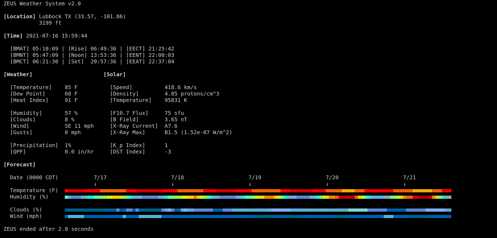

# Zeus

**ZEUS** is a meteorological and astronomical reporting system. Zeus is a Python library consisting of several functions that are run independently in the terminal and use the API of the [National Weather Service](https://www.weather.gov/) (DWML), [NOAA](https://services.swpc.noaa.gov/) (JSON), and [Sunrise-Sunset](https://sunrise-sunset.org/) (JSON).

---

## Installation

The Zeus library has been developed on Ubuntu 18.04 and 20.04 operating systems.

---

## Usage

From the terminal, run the main class `zeus.py` as shown in the following example command:

`$ python3 zeus.py`

The display currently looks like:

---

16 July 2021

Richard Camuccio  
rcamuccio@gmail.com